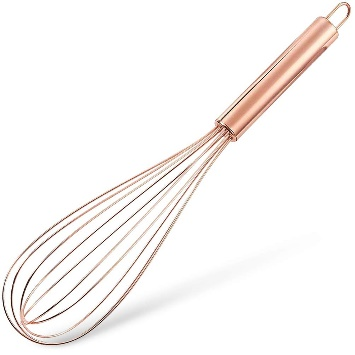

# Welcome! 

Hello Armando, since I cannot be here to make you and my mom breakfast,
here are two recipes you could make with the ingredients I already have!
I also gave my mom two recipes in case you prefer different things! Have
a great morning!

# How to Make Cinnamon Roll Pancakes in My Kitchen **(Figure 3)** 

This task includes instructions on how to easily make a mixture of
pancakes and cinnamon rolls. I hope you enjoy!

## Tools 

\*The following can be found in the cabinet left of the refrigerator and
the drawer beside the sink\*

-   {width="1.6111111111111112in"
    height="1.6111111111111112in"}Large and small bowl (or measuring cup
    can be used)

-   Whisk **(Figure 1)**

-   Measuring cup

-   Tablespoon (tbsp.)

-   Teaspoon (tsp.)

-   Pastry bag **(Figure 2)**

-   Skillet

-   Spatula

## Ingredients 

\*The following can be found in the cabinet right of the microwave

and in the refrigerator\*

{width="1.48125in" height="1.48125in"}

**For the cinnamon pancakes:**

-   Baking powder

-   All-purpose flour

-   Brown sugar

-   Sea Salt

-   Ground cinnamon

-   Maple syrup

-   Margarine **OR** substitute with Vegan margarine

**Note:** You can also use refined coconut oil, but I do not have

-   Almond milk

-   Vegetable oil

    -   This is used to grease the pan

**For the glaze:**

-   Powdered sugar

-   Water

## Steps 

1.  Make the pancake batter.

    a.  Whisk together 1 cup of almond milk and 2 tbsp. of maple syrup
        in a small bowl

    b.  Whisk together 2 tsp. of baking powder and ½ tsp. of sea salt in
        a large bowl

    c.  Mix the small bowl of liquid into the larger bowl

> **Note:** Only whisk until lumps are gone. Do not overmix.

2.  Mix 3 tbsp. of margarine with 5 tbsp. of brown sugar and 2 tsp. of
    cinnamon in a small bowl. Put substance into pastry bag after
    mixing.

3.  Set the stove to just over medium heat. Grease the skillet with the
    vegetable oil.

> **Caution:** My stove gets hot quickly and may become hotter than
> other stoves. For this reason, you can leave the heat at medium and
> increase temperature is needed.

4.  Pour the batter and the substance in the pastry bag into the
    skillet.

    a.  Once hot, use a measuring cup to pour ¼ cup of batter into the
        skillet.

    b.  Squeeze out the brown sugar mix from the pastry bag in a
        swirling motion on top of the pancake batter until you reach the
        edge of the pancake.

5.  When the pancake begins to bubble use the spatula to flip it onto
    the other side.

> **Note:** Bubbling should happen within 3-4 minutes.

6.  Allow pancake to cook on the other side for 1 minute, or until light
    brown. Follow the same steps until the batter is gone.

> **Note:** Do not forget to apply more vegetable oil as needed.

7.  Make the glaze.

    a.  Mix 2 cups of powdered sugar and ¼ cup of water. Whisk
        thoroughly.

    b.  Pour onto cooked pancakes

{width="4.772916666666666in"
height="2.6847222222222222in"}

**Figure 3. Cinnamon Roll Pancakes**

[**https://www.today.com/recipes/cinnamon-roll-pancakes-recipe-t136088**](https://www.today.com/recipes/cinnamon-roll-pancakes-recipe-t136088)

#  How to Make Oatmeal with Pear and Almonds in My Kitchen **(Figure 4)**

This task provides a quick and easy vegan breakfast recipe to help you
make oatmeal even better!

## Tools 

\*The following can be found in the cabinet left of the refrigerator and
the drawer beside the sink\*

-   Cooking pot

-   Regular size spoon

-   Small bowl

## Ingredients 

\*The following can be found in the cabinet right of the microwave

and in the refrigerator\*

-   Water

-   Salt

-   Old fashioned oats

-   Chopped almonds **(Optional)**

-   Sliced pear **(Optional)**

-   Ground cinnamon

-   Vanilla extract

-   Honey **(Optional)**

## Steps

1.  Fill the pot with 3 ½ cups of water and add 1 pinch of salt.

2.  Turn on stove eye to high heat and place the pot of water on the
    stove.

3.  Once the water comes to a boil, add 2 cups of oats, reduce heat to
    low-medium. Stir oats often, for 5 minutes.

> **Note:** If you do not want to make that much oatmeal, reduce
> measurements accordingly.

4.  Add 1 tsp. of cinnamon and ½ tsp. of vanilla into pot. Stir.

5.  Continue cooking for 2 minutes or until oats are creamy.

6.  When done, place oats into a small bowl.

> **(Optional)** Add ¼ sliced pear and 1 tbsp. chopped almonds. Top with
> 1 tsp. of honey.
>
> {width="4.351388888888889in"
> height="2.172222222222222in"}

**Figure 4. Oatmeal with Pears and Almonds**
<https://www.today.com/recipes/oatmeal-pear-almonds-recipe-t165151>

# Welcome! 

Hey mom! I am sorry I could not be there to help with breakfast this
morning, but here are two super simple recipes I really like to make on
the go, and I think you should try them! This way, you'll know I
actually eat decent when I am not living at home. I also left Armando
two vegan recipes if you would like to try those instead!

# How to Make a Sausage, Egg, and Cheese English Muffin in My Kitchen **(Figure 5)**

This task includes instructions on making a sausage, egg, and cheese
English muffin sandwich. I hope you like it!

## Tools 

\*The following can be found in the cabinet left of the refrigerator and
the drawer beside the sink\*

-   Skillet

-   Spatula

-   Small bowl

## Ingredients 

\*The following can be found in the cabinet right of the microwave and
in the refrigerator\*

-   English muffin

-   1 or 2 eggs

-   American or provolone cheese

-   ½ an inch slice of ground sausage

-   Vegetable oil (to grease pan)

## Steps 

1.  Turn stove on to medium-high and oil skillet.

**Caution:** May have to turn down quicker than other stoves, this one
heats quickly.

2.  Beat 2 eggs in a small bowl and pour into skillet.

    a.  Allow eggs to sit until they begin to bubble.

    b.  Fold the egg and finish cooking for 1 minute. Set eggs to side.

3.  {width="1.675in" height="1.675in"}Slice
    ½ inch of ground sausage patties.

4.  Leaving stove on medium-high heat, recoat skillet and place back on
    the stove.

5.  Place sausage in skillet for 3 minutes on each side. Set to the side
    when done.

6.  Wash and dry skillet, then coat with butter.

7.  Lower the heat to medium and put the English muffin into the skillet
    until it turns golden brown.

8.  While still in the skillet, place sausage, egg, and cheese on to
    muffin. Put the muffin together.

9.  Eat while warm and enjoy!

# How to Make a New Kind of Berry French Toast in My Kitchen **(Figure 6)**

This task explains how to make french toast differently than usual. Best
recipe ever!

## Tools

\*The following can be found in the cabinet left of the refrigerator and
the drawer beside the sink\*

-   Skillet

-   Spatula

-   Medium-sized bowl

-   Plate

## Ingredients 

\*The following can be found in the cabinet right of the microwave

and in the refrigerator\*

-   1 egg

-   ½ cup of milk

-   2 tablespoons of butter

-   1 teaspoon of sugar

-   1 teaspoon cinnamon

-   Bread

-   Syrup **(Optional)**

-   Powdered sugar **(Optional)**

-   Assorted berries **(Optional)**

## Steps 

1.  Beat egg in a medium-sized bowl.

2.  Add ½ cup of milk, 1 tsp. of sugar, and 1 tsp. of cinnamon into the
    medium-sized bowl

3.  Soften butter in skillet

4.  Pour substance from bowl into skillet, mix, and set to the side

5.  {width="2.0180555555555557in"
    height="3.027083333333333in"}Pour enough liquid mix onto a plate to
    dip bread.

6.  Set stove between medium and medium-high. Place skillet.

    a.  Bottom of the skillet should be coated with butter.

7.  Dip a piece of bread in the mix on the plate.

> **Note:** Make sure it is even on both sides.

8.  Lay coated bread into the skillet and toast on each side for 1
    minute.

9.  **(Optional)** Add powdered sugar, syrup, and assorted berries.

10. Repeat for as many pieces as you want.

**Figure 6. Berry French Toast**

**Picture from: <https://foodwithfeeling.com/easy-french-toast/>**
