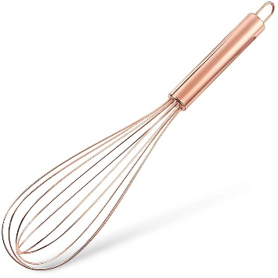
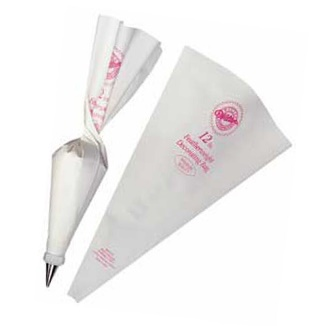
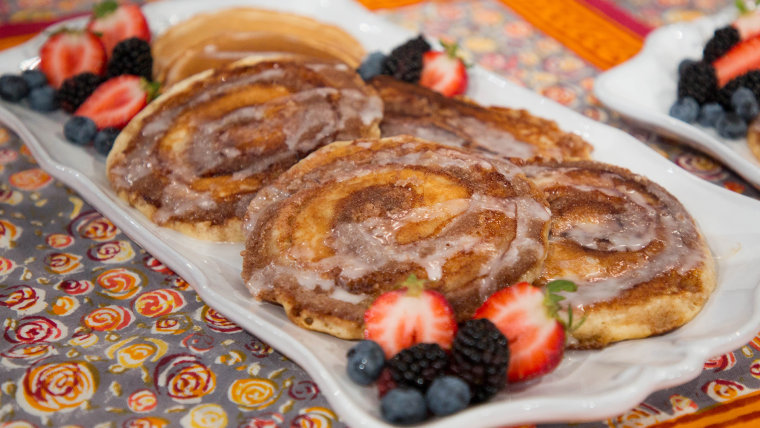

# Welcome! 

Hello Armando, since I cannot be here to make you and my mom breakfast,
here are two recipes you could make with the ingredients I already have!
I also gave my mom two recipes in case you prefer different things! Have
a great morning!

# How to Make Cinnamon Roll Pancakes in My Kitchen **(Figure 3)** 

This task includes instructions on how to easily make a mixture of
pancakes and cinnamon rolls. I hope you enjoy!

## Tools 

\*The following can be found in the cabinet left of the refrigerator and
the drawer beside the sink\*

-   {width="1.6111111111111112in"
    height="1.6111111111111112in"}Large and small bowl (or measuring cup
    can be used)

-   Whisk **(Figure 1)**

-   Measuring cup

-   Tablespoon (tbsp.)

-   Teaspoon (tsp.)

-   Pastry bag **(Figure 2)**

-   Skillet

-   Spatula

## Ingredients 

\*The following can be found in the cabinet right of the microwave

and in the refrigerator\*

{width="1.48125in" height="1.48125in"}

**For the cinnamon pancakes:**

-   Baking powder

-   All-purpose flour

-   Brown sugar

-   Sea Salt

-   Ground cinnamon

-   Maple syrup

-   Margarine **OR** substitute with Vegan margarine

**Note:** You can also use refined coconut oil, but I do not have

-   Almond milk

-   Vegetable oil

    -   This is used to grease the pan

**For the glaze:**

-   Powdered sugar

-   Water

## Steps 

1.  Make the pancake batter.

    a.  Whisk together 1 cup of almond milk and 2 tbsp. of maple syrup
        in a small bowl

    b.  Whisk together 2 tsp. of baking powder and ½ tsp. of sea salt in
        a large bowl

    c.  Mix the small bowl of liquid into the larger bowl

> **Note:** Only whisk until lumps are gone. Do not overmix.

2.  Mix 3 tbsp. of margarine with 5 tbsp. of brown sugar and 2 tsp. of
    cinnamon in a small bowl. Put substance into pastry bag after
    mixing.

3.  Set the stove to just over medium heat. Grease the skillet with the
    vegetable oil.

> **Caution:** My stove gets hot quickly and may become hotter than
> other stoves. For this reason, you can leave the heat at medium and
> increase temperature is needed.

4.  Pour the batter and the substance in the pastry bag into the
    skillet.

    a.  Once hot, use a measuring cup to pour ¼ cup of batter into the
        skillet.

    b.  Squeeze out the brown sugar mix from the pastry bag in a
        swirling motion on top of the pancake batter until you reach the
        edge of the pancake.

5.  When the pancake begins to bubble use the spatula to flip it onto
    the other side.

> **Note:** Bubbling should happen within 3-4 minutes.

6.  Allow pancake to cook on the other side for 1 minute, or until light
    brown. Follow the same steps until the batter is gone.

> **Note:** Do not forget to apply more vegetable oil as needed.

7.  Make the glaze.

    a.  Mix 2 cups of powdered sugar and ¼ cup of water. Whisk
        thoroughly.

    b.  Pour onto cooked pancakes

{width="4.772916666666666in"
height="2.6847222222222222in"}

**Figure 3. Cinnamon Roll Pancakes**

[**https://www.today.com/recipes/cinnamon-roll-pancakes-recipe-t136088**](https://www.today.com/recipes/cinnamon-roll-pancakes-recipe-t136088)